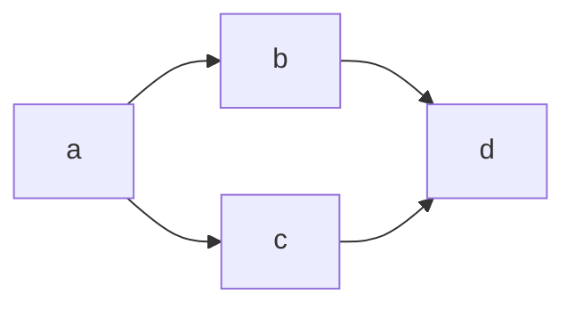

## Mermaid介绍
* 基于 Javascript 的绘图工具
* Typora 支持渲染 Mermaid 语法
* 使用markdown代码块编写，并选择语言 `mermaid`，如果工具支持即可渲染

## Mermaid绘制流程图

### 基本语法
* `id[description]`
id就是一个节点，后面是此id的描述文本

#### 图表方向
`graph <dir>`
* TB (Top to Bottom)
* BT (Bottom to Top)
* LR (Left to Right)
* RL (Right to Left)

#### 图形
* 矩形：`[]`
* 长方形带圆角：`()`
* 长圆形：`([])`
* 圆形：`(())`
* 圆柱：`[()]`
* 菱形：`{}`
* 六角形：`{{}}`
* 平行四边形：`[/ /]` or `[\ \]` 

#### 连线
* 实线：`--`
* 虚线：`-.`
* 带箭头：`>`
* 实线有描述：`--description--` or `--|description|`
* 加粗实线：`==`

### 高级用法

* 如果文本里带 `()` 等符号，使用 `""` 将文本包裹起来
* 单个节点连接多个节点

* 流程图嵌套
* 使用 `%%` 注释

## 参考连接
> [快速上手mermadi流程图](https://snowdreams1006.github.io/write/mermaid-flow-chart.html)
> 
