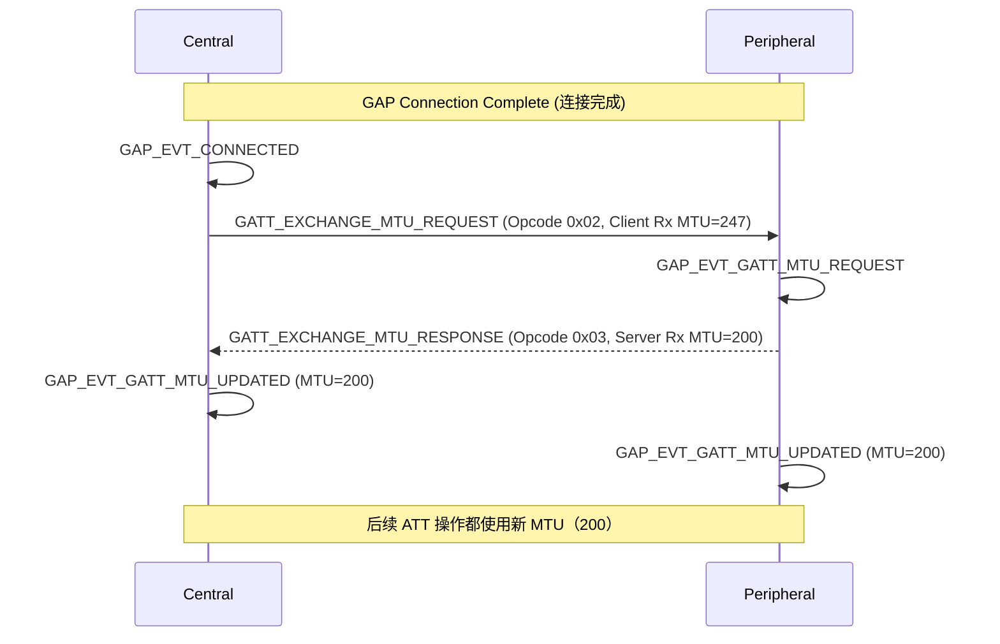

central、peripheral 都可以发起更新

```mermaid
sequenceDiagram
    Note over Central,Peripheral: GAP Connection Complete (连接完成)

    Central->>Central: GAP_EVT_CONNECTED
    Central->>Peripheral: GATT_EXCHANGE_MTU_REQUEST (Opcode 0x02, Client Rx MTU=247)
    Peripheral->>Peripheral: GAP_EVT_GATT_MTU_REQUEST
    Peripheral-->>Central: GATT_EXCHANGE_MTU_RESPONSE (Opcode 0x03, Server Rx MTU=200)

    Central->>Central: GAP_EVT_GATT_MTU_UPDATED (MTU=200)
    Peripheral->>Peripheral: GAP_EVT_GATT_MTU_UPDATED (MTU=200)

    Note over Central,Peripheral: 后续 ATT 操作都使用新 MTU（200）
```