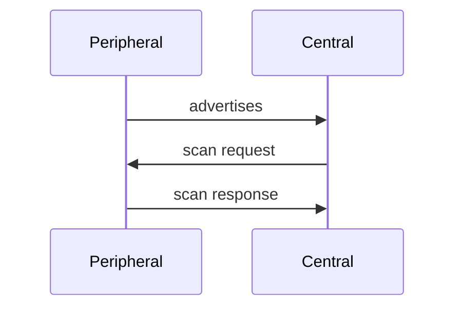

BLE 广播是蓝牙建立连接前的重要过程，其目的是：
1. 告诉周围人有这么一个设备。（需不需要建立连接发送数据）
2. 告诉的过程顺带说明我是个啥设备。（携带自定义数据）

## 广播

* 蓝牙工作的频段 2.4G (2402MHz-2480MHz)
* 40 个信道，3 个广播（37 38 39） + 37 个数据信道


### 广播 PDU（Protocol Data Unit）


nrf sniffer 或者 bleAnalyzer 这些抓包工具都能自动解析广播包 PDU，我们重点关注

1. PDU Type：广播类型
2. AdvA：广播设备的地址
3. Advertising Data：广播数据


### 广播包数据格式

BLE 广播包最大长度 37 字节，设备地址 ADVA 用了 6 个，剩下 31 个字节按一定格式分为 n 个 AD Structure


AD Structure 格式：
```
Len(1B) + AD Type(1B) + AD Data(nB)
```

len 为 AD Type + AD Data 长度


#### AD Type

> 参考 [Assigned_Number / 2.3 Common Data Types](https://www.bluetooth.com/wp-content/uploads/Files/Specification/HTML/Assigned_Numbers/out/en/Assigned_Numbers.pdf)


##### （0x01）AD_TYPE_FLAGS

用于描述设备的广播行为和兼容性，value 是一个 8 bit 掩码

- bit 描述

    | **位索引** | **名称**                                | **值** | **说明**                                                                 |
    |------------|----------------------------------------|--------|--------------------------------------------------------------------------|
    | **Bit 0**  | LE Limited Discoverable Mode           | 0/1    | 设备处于 **有限可发现模式**（通常持续 30 秒~1 分钟）。                     |
    | **Bit 1**  | LE General Discoverable Mode           | 0/1    | 设备处于 **通用可发现模式**（持续广播直至手动关闭）。                       |
    | **Bit 2**  | BR/EDR Not Supported                    | 0/1    | 设备 **不支持经典蓝牙（BR/EDR）**。若为 0，表示支持或未知。                |
    | **Bit 3**  | Simultaneous LE and BR/EDR (Controller)| 0/1    | 设备控制器（硬件）**同时支持 BLE 和经典蓝牙**。                            |
    | **Bit 4**  | Simultaneous LE and BR/EDR (Host)      | 0/1    | 设备主机（软件协议栈）**同时支持 BLE 和经典蓝牙**。                        |
    | **Bit 5-7**| Reserved                               | 0      | 保留位，必须设置为 `0`。                                                  |

- 常见 Flags 数值及含义

  - 0x06（0000 0110）: 通用可发现 + 不支持经典蓝牙
  - 0x02（0000 0010）: 通用可发现 + 可能支持经典蓝牙
  - 0x04（0000 0100）: 不可被发现 + 不支持经典蓝牙
  - 0x1A（0001 1010）: 通用可发现 + 支持双模

- 特殊规则

  - 互斥性：
    - Bit 0 和 Bit 1 不可同时为 1（设备不能同时处于有限和通用可发现模式）。
    - 若 Bit 0=1（有限可发现模式），广播需在 1 分钟内停止或切换为其他模式。
  - 经典蓝牙兼容性：
    - 若设备支持经典蓝牙（如双模耳机），需设置：  
      - Bit 2=0（支持 BR/EDR）  
      - Bit 3=1（控制器支持双模）  
      - Bit 4=1（主机支持双模）  
    - 若不支持经典蓝牙（如纯 BLE 设备），Bit 2 必须为 1。

##### （0x03）AD_TYPE_COMPLETE_LIST_16_BIT_UUID

描述设备支持的服务，比如是 0x1812 hid 服务，主机可能会显示 hid 设备的图标

##### （0x09）AD_TYPE_COMPLETE_LOCAL_NAME

设备完整名称，如果没有，调试助手名称一栏可能显示 N/A

##### （0xFF）AD_TYPE_MANU_SPECIFIC_DATA

厂商自定义字段

### 广播包类型

* ADV_IND
* ADV_DIRECT_IND
* ADV_NONCONN_IND
* SCAN_REQ
* SCAN_RSP
* CONNECT_REQ
* ADV_SCAN_IND
* Reserved


### 广播扫描响应的示意图


为什么有 scan response？
如果广播数据太多，31 个字节放不下时，我们就可以将一部分不重要的数据放进 scan response 数据里来分担广播数据的工作


