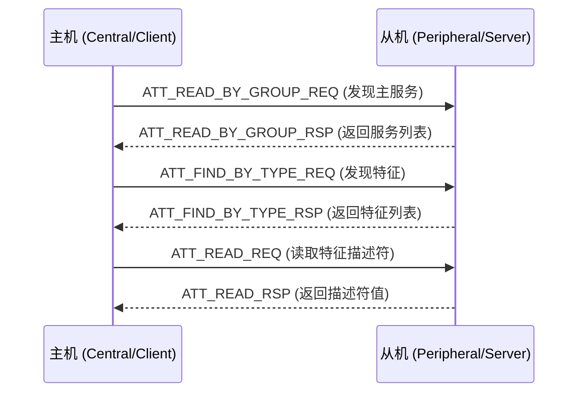

### 连接过程

### 服务发现过程

```mermaid
sequenceDiagram
    participant 主机 as 主机 (Central/Client)
    participant 从机 as 从机 (Peripheral/Server)
    
    主机->>从机: ATT_READ_BY_GROUP_REQ (发现主服务)
    从机-->>主机: ATT_READ_BY_GROUP_RSP (返回服务列表)
    
    主机->>从机: ATT_FIND_BY_TYPE_REQ (发现特征)
    从机-->>主机: ATT_FIND_BY_TYPE_RSP (返回特征列表)
    
    主机->>从机: ATT_READ_REQ (读取特征描述符)
    从机-->>主机: ATT_READ_RSP (返回描述符值)
```

