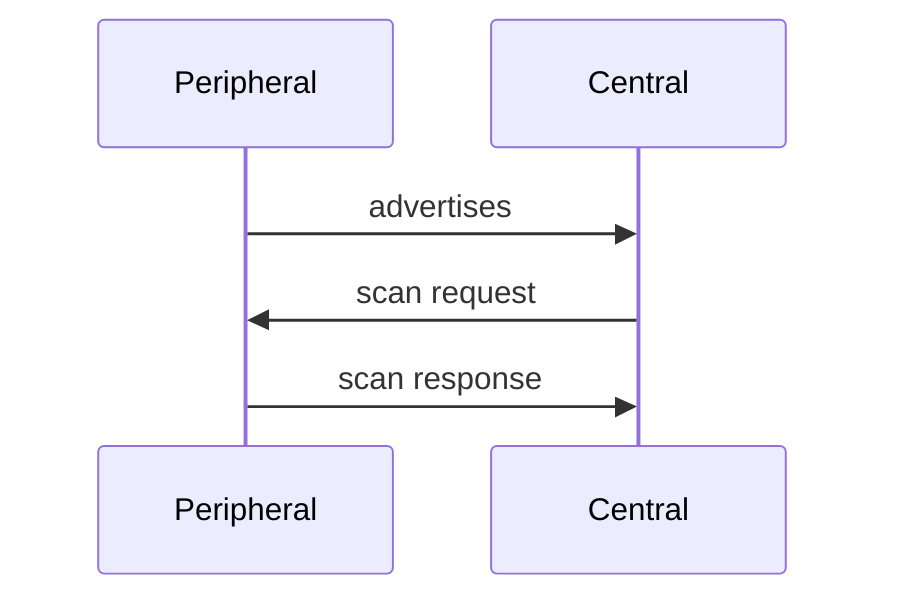
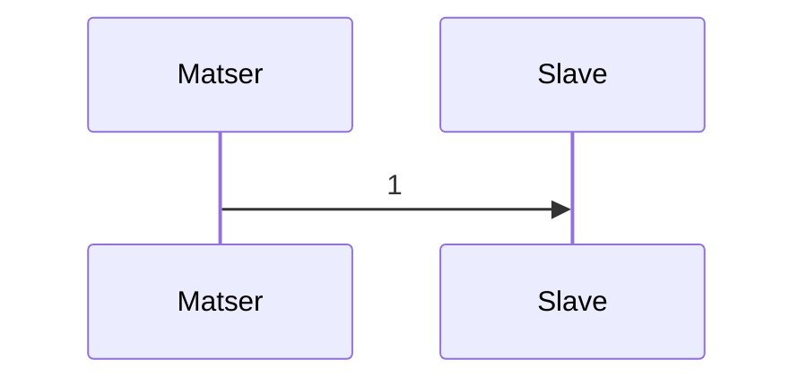

# BLE 系统学习

> [蓝牙官网资料](https://www.bluetooth.com/zh-cn/specifications/specs/)
> [蓝牙连接参数更新](https://developers.goodix.com/zh/bbs/blog_detail/c12a1e1d68fc4c7893b11cab69851378)
> [CSDN 专栏](https://blog.csdn.net/zhoutaopower/category_9083143.html)


#### 各种角色对应关系
| 遥控器  | 机顶盒  |
|---|---|
| gatt server  | gatt client  |
|外围设备|中央设备|
|从机|主机|


## 协议栈
**架构**


* Applications
* HOST
  * GAP(Generic access profile)
  * GATT
  * ATT
  * SM(Security Manager)
  * L2CAP(Logical Link Control Adaptation Protocol)
* Controller
  * Link Layer(LL)
  * Physical Layer

### HCI
HCI 即 HOST Controller Interface
1. HCI command，是蓝牙协议栈通过给上层发送命令来控制芯片的行为，分几个 OGF(group)
2. HCI event，蓝牙芯片给蓝牙协议栈的事件
3. HCI acl 数据，蓝牙协议栈跟蓝牙芯片双向交互的 L2CAP 以及上层数据
4. HCI sco, 蓝牙协议栈跟蓝牙芯片交互的 SCO 音频是数据
5. HCI iso, 蓝牙协议栈跟蓝牙芯片交互的 BLE audio 的数据（Core 5.2 才增加）

#### HCI command


OpCode: 长度 2byte 的操作码，分两个字段
* OGF(Opcode Group Field)：操作码组字段，占高 6bit
* OCF(Opcode Command Field)：操作码命令字段，占低 10bit

OGF 分以下几组：
* 0x01: Link Control commands，链路控制的，控制蓝牙跟 remote 沟通的
* 0x02: Link Policy commands，链路策略，比如转换角色等
* 0x03: HCI Control and Baseband commands，控制本地芯片跟基带的 OGF，比如 reset 本地芯片
* 0x04: Informational Parameters commands，读取信息，本地芯片的 LMP 版本、支持的 command、蓝牙地址等
* 0x05: status parameters commands，读取状态的命令，比如 rssi
* 0x06: Testing commands（进入测试模式的命令，DUT，device under test）
* 0x08: LE Controller commands，
* 0x3F: vendor-specific debug commands，厂商定义的

OCF 很多，每个 OCF 后面带 参数总长度，参数。

HCI Command Packet 的长度不超过 255，包括上面的包头

## 广播
* 蓝牙工作的频段 2.4G (2402MHz-2480MHz)
* 40 个信道，3 个广播+37 个数据


### 广播包数据格式
蓝牙广播包最大长度 37 字节，设备地址 ADVA 用了 6 个，剩下 31 个字节按一定格式分为 n 个 AD Structure


AD Structure 格式：
Len(1B)+Type(1B)+DATA(nB)
其中，len 包括 Type

**广播扫描响应的示意图**


为什么有 scan response？
如果广播数据太多，31 个字节放不下时，我们就可以将一部分不重要的数据放进 scan response 数据里来分担广播数据的工作

## 蓝牙配对与绑定

#### 配对过程总体框图

总体分为三个阶段：
1. 特性交换
2. 密钥交换 (STK/LTK)
3. 密钥分发 distribution

配对 (Paring) 和绑定 (bonding) 是实现蓝牙通讯安全的一种机制，有两个点：
1. paring/bonding 实现的是蓝牙链路层的安全，对应用完全透明。（不需要应用对数据做特殊处理）
2. 实现安全有两种选择：加密 encrypt/签名 signature，大多应用选择加密。用户也可以在应用上实现相同功能，只不过自己实现的话涉及很多技术，密码算法、密钥生成、密钥交换等，所以专业的事交给专业的人做得了。
paring/bonding 把上述的过程标准化放在蓝牙协议栈里，使得用户可以"无感"使用蓝牙安全通信。

paring/bonding 是蓝牙 SM（security manager）里的一部分，SM 定义了蓝牙通讯的安全框架，里面涉及安全架构、密码工具箱、paring 协议等。paring 协议比较关键，所以常把 SM 和 paring 等价。

## 连接参数的更新

### 基础概念
#### Connection Event（连接事件）
* 连接事件是指 Master 与 Slave 之间相互发送数据包的过程
* 每个连接事件都是 Master 发起，Slave 回复
* Master 和 Slave 可以在一个连接事件种发送多个包
* Master 和 Slave 都有一个 16bit 的连接事件计数器（connEventCounter），它在第一个连接事件时设置 0，产生新的连接事件就加 1，用于同步链路层控制程序 LLCP

#### Connection Interval（连接间隔）
* 连接间隔决定了 Master 和 Slave 两个连续事件之间的时间长度
* Interval_min 和 Interval_max 描述了连接间隔取值范围，是 Slave 向 Master “建议” 的，连接间隔最终取值由 Master 决定
* 单位 1.25ms，取值范围 6-3200，即 7.5ms-4000ms

#### Slave latency
从设备延迟，是指 Slave 可以调过的连接事件的次数。没有数据要发送时 Slave 可以跳过回复 Master 一定个数的连接事件，从而达到省电的目的
latency 取值范围 0-499


#### Supervision Timeout
监控时间设置了一个超时时间，如果 Master 和 Slave 超过这个时间没有通信的话就会自动断开
单位 10ms，取值范围 10-3200
timeout 应该满足：timeout > (latency+1)*interval * N, N>=2
> 注：关于 n 的取值，《低功耗蓝牙开发指南》建议为 6，原文：
> 如果将从设备延迟设为可行的最大值，在监控超时发生前从设备只能获取唯一一次的侦听主设备的机会，这并不是一个好的处理方法。因此，建议至少给从设备留出 6 次侦听的机会，如果连接间隔为 100ms，从设备延迟为 9，那么监控超时应该至少为 6S，这样一来，链路在最终断开前从设备至少会有 6 次侦听的机会。
> n 的取值过小会降低链路的容错能力，过大时也会导致当对端设备断电时，需要等待较长的时间才会上报设备断开信息，n 的取值可以根据实际应用情况调整。

不同配置的连接参数对通信速率和功耗的影响：
* interval 缩短，Master 和 Slave 通信频率增加，数据发送周期缩短，数据发送速度增加，功耗增加
* interval 变长，Master 和 Slave 通信频率减少，数据发送周期增长，数据发送速度降低，功耗降低
* latency 增加，slave 回复次数减少，功耗降低

### 连接参数更新流程
Master = 机顶盒；Slaver = 遥控器


#### LLCP（经典蓝牙中，略）
LLCP（链路层控制程序）
* Master 需要更新时，可向 Slave 发送连接参数更新请求** LL_CONNECTION_PARAM_REQ**，也可以最直接通知 Slave 更新 **LL_CONNECTION_UPDATE_IND** 而不需要协商
* Slave 需要更新时，需要向主设备发送连接参数更新请求** LL_CONNECTION_PARAM_REQ**

无论 Master 发起还是 Slave 发起，都只能由 Master 发起连接参数更新通知来应用新的连接参数

LLCP 更新流程
Slave 发起流程
```Mermaid
graph 
    Slave -- LL_CONNECTION_PARAM_REQ --> Master
    Slave --> Master

    Master -- LL_CONNECTION_UNKNOWN_RSP --> Slave

    %% Slave->>Master: LL_CONNECTION_PARAM_REQ
    %% Master->>Slave: LL_UNKNOWN_RSP

    %% Slave->>Master: LL_CONNECTION_PARAM_REQ
    %% Master->>Slave: LL_REJECT_EXT_IND

    %% Slave->>Master: LL_CONNECTION_PARAM_REQ
    %% Master->>Slave: LL_CONNECTION_UPDATE_IND
```

Master 发起更新请求
```Mermaid
sequenceDiagram
    Master->>Slave: LL_CONNECTION_PARAM_REQ
    Slave->>Master: LL_UNKNOWN_RSP

    Master->>Slave: LL_CONNECTION_PARAM_REQ
    Slave->>Master: LL_REJECT_EXT_IND

    Master->>Slave: LL_CONNECTION_PARAM_REQ
    Slave->>Master: LL_CONNECTION_PARAM_RSP
    Master->>Slave: LL_CONNECTION_UPDATE_IND
```

* 如果接收方不能解析 LL_CONNECTION_PARAM_REQ，则回复 LL_UNKNOWN_RSP，双方继续使用之前的连接参数交互

* LL_CONNECTION_PARAM_REQ(0x0F)
* LL_CONNECTION_PARAM_RSP(0x10)
  * PDU 和 LL_CONNECTION_PARAM_REQ 一样

#### L2CAP
Master 需要更新时，直接发送 LL_CONNECTION_UPDATE_IND
```Mermaid
sequenceDiagram
    Master->>Slave: LL_CONNECTION_UPDATE_IND
    Note over Master,Slave: 应用新的连接参数
```
Slave 需要更新时，需要发送更新请求 (Connection Parameter Update Request)
```Mermaid
sequenceDiagram
    Slave->>Master: L2CAP 连接参数更新请求 (0x12)
    Master->>Slave: L2CAP 连接参数更新响应 (0x13)
    Master->>Slave: LL_CONNECTION_UPDATE_IND(0x00)
    Note over Master,Slave: 应用新的连接参数
```
说明：
* 0x12：只能由 Slave 发送给 Master，PDU 包括 Interval Min，Interval Max，Latency，Timeout
* 0x13：无论是否接受该请求，都需要回应，0 表示接收，1 表示拒绝
* 0x00：若 Slave 支持 PDU 中的连接参数，则应用；若不支持，则断开连接
* 
## 蓝牙状态机
蓝牙链路层的状态机有 5 种状态
* 就绪态
* 广播态
* 链接态
* 扫描态
* 发起链接态


* 设备上电时处于就绪态

### 基本概念理解
* **Paring**
* **Bonding**
* **SM（security manager）**：蓝牙协议栈的安全管理层，规定了跟蓝牙安全通信有关的所有要素，包括 paring，bonding，以及下文提到的 SMP。
* **SMP（security manager protocol）**
* **OOB**
* **Passkey/pin 码**
* **Numeric comparison**
* **MITM（man in the middle）**："第三者"，比如 AB 在安全通信，C 伪装 A 或 B 插入进来。如果对安全性比较高，就需要具备 MITM 保护能力。在 SM 中 MITM 保护是通过认证（authentication）来实现的，SM 中实现认证的三种方式：OOB,psskey,numeric comparison。
* **LESC（LE secure connections）**，也叫 SC
* **Legacy paring**，在 LESC 引入之前的密钥生成方式，称为 legacy paring，换句话说，legacy paring 是相对 LESC 来说的，不支持 LESC 的配对即为 legacy paring（legacy 配对）。
* **TK（Temporary Key，临时密钥）**
* **STK（short term key，短期密钥）**
* **LTK（long term key，长期密钥）**
* **IRK（Identity Resolving Key，蓝牙设备地址解析密钥）**：
* **Identity Address（设备唯一地址）**
* **IO capabilities（输入输出能力）**
* **Key size（密钥长度）**

https://www.cnblogs.com/iini/p/12801242.html

### ATT 属性（服务里面带的）

```c
#define ATT_PROPERTY_BROADCAST              0x01
#define ATT_PROPERTY_READ                   0x02
#define ATT_PROPERTY_WRITE_WITHOUT_RESPONSE 0x04
#define ATT_PROPERTY_WRITE                  0x08
#define ATT_PROPERTY_NOTIFY                 0x10
#define ATT_PROPERTY_INDICATE               0x20
#define ATT_PROPERTY_AUTHENTICATED_SIGNED_WRITE 0x40
#define ATT_PROPERTY_EXTENDED_PROPERTIES    0x80
```
Central = 机顶盒
Peripheral = 遥控器
* Read：Central 读取 Peripheral 的值（机顶盒读取遥控器），适合静态数据
* Write With Response：Central 写入 Peripheral 并需要 Peripheral 回应
* Write Without Response/Write：无需回应的写入
* Notify：Peripheral 向 Central 发送通知，Central 可以通过 CCCD 特征来订阅通知
* Indicate：类似 Notify 但是需要 Peripheral 发送确认响应，适用确保数据传输可靠性的场景

## 资料汇总
> [52BlueTooth](https://www.52bluetooth.com/)
> [一分钟读懂低功耗蓝牙连接数据包](https://www.52bluetooth.com/forum.php?mod=viewthread&tid=68299&extra=page%3D1)
> [52BlueTooth 蓝牙协议栈教程](https://www.52bluetooth.com/portal.php?mod=list&catid=16)
> 

---

TAG: 刚接触蓝牙的学习

## 蓝牙 OTA

OTA Server
1. SOC mode：system on chip，程序烧录在 flash 里
2. NCP mode：network coprocessor，不能独立工作，需要外部主机来完成工作

OTA Client
ble 中 client 通常指主设备

## BLE 术语
- **通用属性配置文件 (GATT)** — GATT 配置文件是一种通用规范，内容针对在 BLE 链路上发送和接收称为“属性”的简短数据片段。目前所有低功耗应用配置文件均以 GATT 为基础。
    - 蓝牙特别兴趣小组 (Bluetooth SIG) 为低功耗设备定义诸多 [配置文件](https://www.bluetooth.org/en-us/specification/adopted-specifications)。配置文件是描述设备如何在特定应用中工作的规范。请注意，一台设备可以实现多个配置文件。例如，一台设备可能包含心率监测仪和电池电量检测器。
- **属性协议 (ATT)** — 属性协议 (ATT) 是 GATT 的构建基础，二者的关系也被称为 GATT/ATT。ATT 经过优化，可在 BLE 设备上运行。为此，该协议尽可能少地使用字节。每个属性均由通用唯一标识符 (UUID) 进行唯一标识，后者是用于对信息进行唯一标识的字符串 ID 的 128 位标准化格式。由 ATT 传输的_属性_采用_特征_和_服务_格式。
- **特征** — 特征包含一个值和 0 至多个描述特征值的描述符。您可将特征理解为类型，后者与类类似。 
- **描述符** — 描述符是描述特征值的已定义属性。例如，描述符可指定人类可读的描述、特征值的可接受范围或特定于特征值的度量单位。
- **Service** — 服务是一系列特征。例如，您可能拥有名为“心率监测器”的服务，其中包括“心率测量”等特征。您可以在 [bluetooth.org](https://www.bluetooth.org/en-us/specification/adopted-specifications) 上找到基于 GATT 的现有配置文件和服务的列表。

- 中央与外围。这适用于 BLE 连接本身。担任中央角色的设备进行扫描、寻找广播；外围设备发出广播。
- GATT 服务器与 GATT 客户端。这确定两个设备建立连接后如何相互通信。

通常，client 客户端指的是主设备，比如手机电脑等，service 服务端指的才是手表等

## BLE 蓝牙协议：GATT 与 GAP

### GAP(Generic Access Profile)

用来控制设备连接和广播。GAP 使你的设备被其他设备可见，并决定了你的设备是否可以或者怎样与合同设备进行交互。例如 Beacon 设备就只是向外广播，不支持连接，小米手环就等设备就可以与中心设备连接。

GAP 给设备定义了若干角色，两个主要的分为：
1. 外围设备（Peripheral）：小或简单的设备，比如传感器
2. 中心设备（Central）：相对比较强大的设备，比如手机

在 GAP 中外围设备通过两种方式向外**广播数据**，每种数据最长可以包含 31 byte： 
1. Advertising Data Payload（广播数据）
2. Scan Response Data Payload（扫描回复）

这里广播数据是必需的，因为外设必需不停的向外广播，让中心设备知道它的存在。扫描回复是可选的，中心设备可以向外设请求扫描回复，这里包含一些设备额外的信息，例如设备的名字。

大部分情况下，外设通过广播自己来让中心设备发现自己，并建立 GATT 连接，从而进行更多的数据交换。
也有些情况是不需要连接的，只要外设广播自己的数据即可。用这种方式主要目的是让外围设备，把自己的信息发送给多个中心设备。
因为基于 GATT 连接的方式的，只能是一个外设连接一个中心设备。使用广播这种方式最典型的应用就是苹果的 iBeacon。广播工作模式下的网络拓扑图如下：


### GATT（Generic Attribute Profile）

GATT 定义两个 BLE 设备通过叫做 Service 和 Characteristic 的东西进行通信。GATT 就是使用了 ATT（Attribute Protocol）协议，ATT 协议把 Service, Characteristic 遗迹对应的数据保存在一个查找表中，次查找表使用 16 bit ID 作为每一项的索引。

一旦两个设备建立起了连接，GATT 就开始起作用了，这也意味着，你必需完成前面的 GAP 协议。这里需要说明的是，GATT 连接，必需先经过 GAP 协议。实际上，在 Android 开发中，可以直接使用设备的 MAC 地址，发起连接，可以不经过扫描的步骤。这并不意味不需要经过 GAP，实际上在芯片级别已经给你做好了，蓝牙芯片发起连接，总是先扫描设备，扫描到了才会发起连接。

GATT 连接需要特别注意的是：**GATT 连接是独占的**。也就是一个 BLE 外设同时只能被一个中心设备连接。一旦外设被连接，它就会马上停止广播，这样它就对其他设备不可见了。当设备断开，它又开始广播。

中心设备和外设需要双向通信的话，唯一的方式就是建立 GATT 连接。

GATT 的连接网络拓扑结构。这里很清楚的显示，一个外设只能连接一个中心设备，而一个中心设备可以连接多个外设。


一旦建立了连接，通信就是双向的了，对比前面的 GAP 广播的网络塔扑，GAP 通信是单向的。如果你要**让两个外围设备能通信，就只能通过中心设备中转**。

#### GATT 通讯事务

GATT 通信的双方是 C/S 关系
外设作为 GATT 服务端（Server），它维持了 ATT 的查找表以及 service 和 characteristic 的定义。
中心设备是 GATT 客户端（Client），他向 Server 发起请求。
需要注意的是，所有的通信事件，都是由客户端（也叫主设备，Master）发起，并且接收服务端（也叫从设备，Slaver）的响应。

下图展示一个外设（GATT 服务端）和中心设备（GATT 客户端）之间的数据交流流程，可以看到的是，每次都是主设备发起请求：


#### GATT 结构

GATT 事务是建立在嵌套的 Profiles，Services 和 Characteristics 之上的，如下如所示：


* **Profile** Profile 并不是实际存在于 BLE 外设上的，它只是一个被 Bluetooth SIG 或者外设设计者预先定义的 Service 的集合。例如心率 Profile（Heart Rate Profile）就是结合了 Heart Rate Service 和 Device Information Sercvice。所有官方通过 GATT Profile 的列表可以从这里找到。
* **Service** Service 是把数据分成一个个的独立逻辑项，它包含一个或者多个 Characteristic。每个 Service 有一个 UUID 唯一标识。UUID 有 16bit 的，或者 128bit 的。16bit 的 UUID 是官方通过认证的，需要花钱购买，128bit 是自定义的，这个就可以自己随便设置。
* **Characteristic** 在 GATT 事务中的最低界别的是 Characteristic，Characteristic 是最小的逻辑数据单元，当然它可能包含一个组关联的数据，例如加速度计的 X/Y/Z 三轴值。与 Service 类似，每个 Characteristic 用 16bit 或者 128bit 的 UUID 唯一标识。你可以免费使用 Bluetooth SIG 官方定义的标准 Characteristic，使用官方定义的，可以确保 BLE 的软件和硬件能相互理解。当然，你可以自定义 Characteristic，这样的话，就只有你自己的软件和外设能够相互理解。
* 实际上，和 BLE 外设打交道，主要是通过 Characteristic。你可以从 Characteristic 读取数据，也可以往 Characteristic 写数据。这样就实现了双向的通信。所以你可以自己实现一个类似串口（UART）的 service，这个 Service 中包含两个 Characteristic，一个被配置只读的通道（RX），另一个配置为只写的通道（TX）。


## 问题记录

### 蓝牙断连原因汇总

* 0x08 - Connection Timeout
  * 连接超时。这个错误通常发生在连接的一方没有在预期时间内接收到对方的响应。
* 0x13 - Remote User Terminated Connection
  * 远程用户终止了连接。这个错误表示对方设备主动断开了连接。
* 0x14 - Remote Device Terminated Connection Due To Low Resources
  * 远程设备由于资源不足而终止了连接。可能是由于内存不足、电池电量低等原因。
* 0x16 - Connection Terminated by Local Host
  * 本地主机终止了连接。这个错误表示本地设备主动断开了连接。
* 0x3E - Connection Failed to be Established
  * 连接建立失败。这个错误表示连接尝试未成功。
* 0x22 - Instant Passed
  * 在链路层事件中，"Instant" 是一个时间点，用于标记特定事件的时间。如果在到达这个时间点之前未完成预定的操作，就会产生这个错误。
* 0x42 - Unacceptable Connection Parameters
  * 不可接受的连接参数。设备在连接过程中交换了连接参数，但这些参数不被接受。
* 0x28 - Instant Passed
  * 链路层事件中指定的时间点已过，通常在通道映射更新过程中发生。
* 0x3B - MAC Connection Failed
  * MAC层连接失败。这个错误可能与硬件相关的问题有关。

